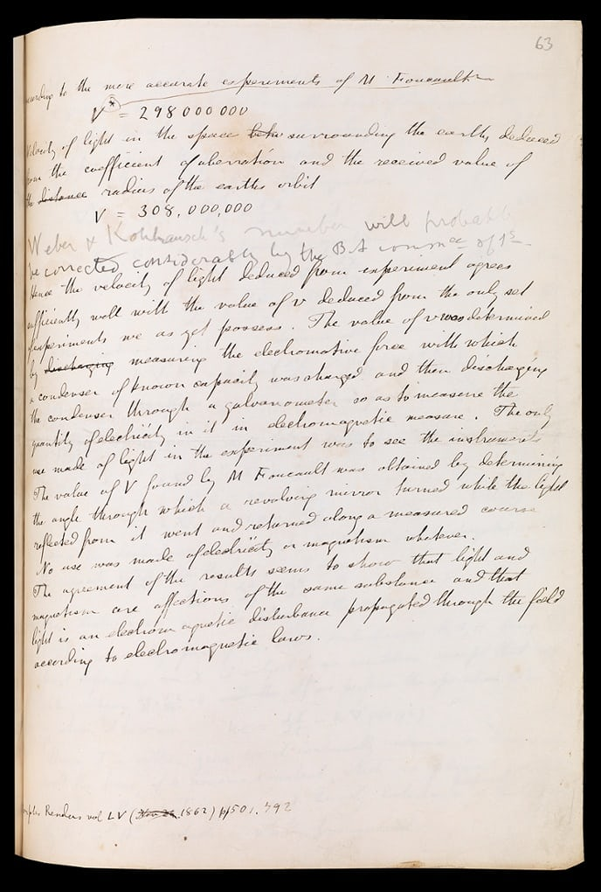

#  Introduction to Reproducible and Dynamic Reporting
2 Hours

-------------------------

## Learning Objectives

* Meet instructors and other course participants
* Describe common tools for producing and publishing a research report
* Discuss elements of a reproducible research report
* Explore a real-life reproducible research report
* Install software needed for this course
* Render a provided reproducible report to multiple outputs using Rstudio, `Rmarkdown`, and the `knitr` package

----------------------------------------------------

## Introductions

Please share the following:

* Name
* Professional position
* One pet peeve about current practices around research communication (authoring, reviewing, or publishing)

## Group Discussion

Automation or transformation: has the research paper changed much in the last 350 years (or why static PDFs are an underwhelming use of today's technology)

Original manuscript of James Clerk Maxwell's paper on 'A dynamical theory of the electromagnetic field' published in the oldest scientific journal, _Philosophical Transactions_, in 1685. According to the publisher, the Royal Society:

> The final sentence on this page records his crucial revelation regarding the nature of light: 'The agreement of the results seems to show that light and magnetism are affections of the same substance and that light is an electromagnetic disturbance propagated through the field according to electromagnetic laws.' (source: https://www.theguardian.com/higher-education-network/gallery/2015/feb/12/philosophical-transactions-of-the-royal-society-350-years-of-science-publishing-in-pictures)

Photograph: Royal Society's collections

### Transforming the scholarly record: what are the _must haves_ of a research report?

1. Registration of the author's claim
2. Certification that the research was conducted properly
3. Dissemination of the work to the right audiences
4. Preservation to ensure a permanent public record of the work that can be found and cited

Source: Rallison, S.P., 'What are Journals For?', _Ann R Coll Surg Engl._ 2015 Mar; 97(2): 89-91. DOI: 10.1308/003588414X14055925061397

## How can authors fulfill these requirements while making their research reports more Findable, Accessible, Interoperable, and Re-Useable/Reproducible?

Now we'll show you the final result (on our machine).  

The first step in getting this dynmaic document is installing some software!

## Software Installation

R is a programming language that is especially powerful for data exploration,
visualization, and statistical analysis. To interact with R, we use RStudio.
For this workshop you'll need to install both R (version 3.4.3 or newer) and
RStudio on your computer.  

### Windows
Install R by downloading and running this
[.exe](https://cran.r-project.org/bin/windows/base/release.htm) file from CRAN. 
Also, please install the [RStudio
IDE](https://www.rstudio.com/products/rstudio/download/#download). 
Note that if you have separate user and admin accounts, you should run the 
installers as administrator (right-click on .exe file and select "Run as administrator" 
instead of double-clicking). Otherwise problems may occur later, for example when installing R packages.

### macOS
Install R by downloading and running this
[.pkg](https://cran.r-project.org/bin/macosx/R-latest.pkg) file from CRAN. Also, 
please install the [RStudio
IDE](https://www.rstudio.com/products/rstudio/download/#download).

### Linux
You can download the binary files for your distribution from
[CRAN](https://cran.r-project.org/index.html). Or you can use your package 
manager (e.g. for Debian/Ubuntu run sudo apt-get install r-base and for 
Fedora run sudo dnf install R). Also, please install the [RStudio
IDE](https://www.rstudio.com/products/rstudio/download/#download).

## Workshop Files

You also need to download some files for this workshop:

1. Download [this zip file](/FSCI-2018/data/FSCI-2018-files.zip) and move
the file to your desktop.
2. If it's not unzipped yet, double-click on it to unzip it. You should end up
with a new folder called `FSCI-2018-files`.

## Intro to RStudio and knitting documents

Now open Rstudio (Applications/Rstudio).  Rstudio is the development
environment where we'll be working on our document.  The main panel you'll see
on the left is the Console, where you can run R code.  On the right is two
panels - the upper contains your environment (what R can access), and the lower
contains the files on your computer.  

The first thing to do is install some packages.  RStudio makes it easy to
install new packages to do things you want.  You can find packages by going to
the 'Packages' tab in the lower right panel.  You can install new packages by
clicking the Install button and typing in the package name.  For this workshop
we'll need the following packages:

- `tidyverse`
- `DT`
- `rorcid`
- `httpuv`

Now let's actually work with a document.  Click in the Files tab in the lower
right panel.  The file view in RStudio is just like
navigating in finder or windows explorer.  Let's find the `FSCI-2018-files`
folder we downloaded above.  Go to Desktop and `FSCI-2018-files`.  You'll see
lots of files we'll use during the workshop.  Double click on
`Base_2013_day1_in.Rmd`.  

You'll see the document open in a new panel on the left hand side of the
screen.  This is an editor window, and you can change things in the document
here.  For now, just change the name in the document to your name.  

Knitting is a process in Rstudio that takes a text document and turns it into
an output (like html, docx, or html slides).  Now click the knit button in the upper
left hand corner of the editor.    The first
time you do this you'll get a message that you need to install some packages.
You'll want to click Yes and wait for the packages to install.  Once the
installation you'll see an interactive demonstration document!

You can output this single file in multiple formats.  By default we've been
generating .html files, but we can also output to a word document.  If you
click on the downward arrow next to the knit button we see some default
formats.  Click on Word, and a word document will appear.  

While pdf is an option, this requires a TeX distribution which is complex to
install and beyond the scope of  this course.

You can also select other output forms that aren't listed in the `knitr`
dropdown.  Take a look at the document.  You'll see in the top a section called
`output` with sections under it like `html_document`.  If we change the top
output knit will produce a different result.  Try replacing `word_document`
with `slidy_presentation`.  This is a html presentation that you can use in 
any web browser.

Tomorrow we'll start working with an actual research report !

Next: [Basic Markdown](02-markdown.html)
